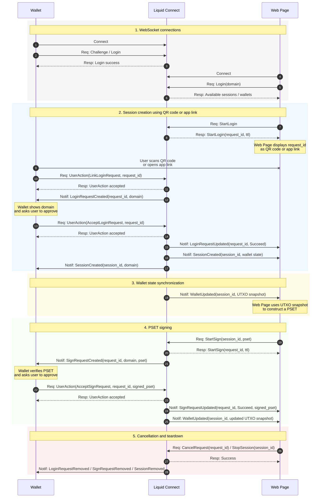
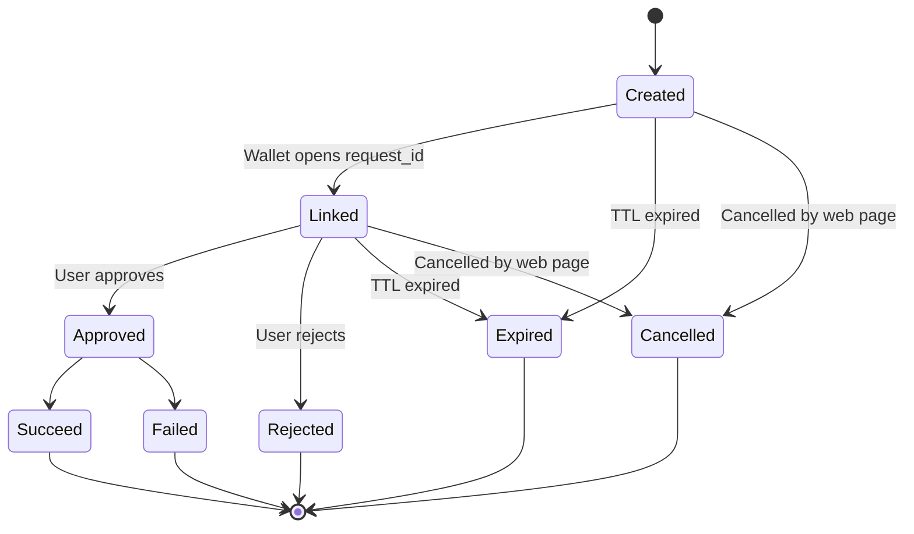

# Liquid Connect API

## Overview

Liquid Connect allows web pages to extend Liquid wallets with external functionality such as trading, bets, swaps, and other contract-based flows.

The main challenge is that a web page often needs an up-to-date view of the wallet’s UTXOs in order to construct a valid PSET. A one-time UTXO snapshot is not enough: while the user is interacting with the web page, existing UTXOs may be spent and new UTXOs may appear.

The most reliable way to keep the UTXO set current is to derive wallet addresses from the wallet descriptor and continuously track wallet activity. However, sharing a wallet descriptor directly with an arbitrary web page is too risky: the web page would be able to observe past and future wallet history.

Liquid Connect solves this by introducing a trusted intermediate server:

- The wallet connects to Liquid Connect.
- The wallet shares its descriptor with Liquid Connect, not with the web page.
- The web page receives only session-scoped wallet state, such as UTXO snapshots.
- The web page constructs PSETs and sends them for signing.
- The wallet remains the only party that can approve and sign transactions.

Liquid Connect improves usability while keeping private keys inside the wallet.

## Actors

| Actor | Role |
| --- | --- |
| Wallet | User-controlled wallet application. Holds keys, verifies requests, approves sessions, and signs PSETs. |
| Liquid Connect | Trusted coordination server. Maintains wallet sessions, tracks UTXOs, forwards requests and notifications. |
| Web Page | External application that wants to use the wallet for trading, betting, swaps, or other flows. |

## Trust model

Liquid Connect is trusted with wallet metadata such as descriptors and UTXO state.

Liquid Connect is **not** trusted with private keys and cannot sign or spend funds by itself.

The web page is not trusted with the wallet descriptor. It only receives the data needed for the approved session.

The wallet must always verify what it signs. In particular, it should validate:

- the requesting domain;
- the PSET contents;
- outputs and destination addresses;
- asset amounts;
- fees;
- change outputs;
- whether the request matches the user-visible action.

## Main concepts

### Session

A session links a wallet, a web page domain, and Liquid Connect.

A session is created only after the wallet approves a login request from the web page.

```rust
pub struct Session {
    pub session_id: String,
    pub domain: String,
    pub is_local: bool,
}
```

### Request ID

A `request_id` identifies a pending user action.

For example, when a web page starts a login flow, Liquid Connect creates a new `request_id`. The web page can display this value as:

- a QR code;
- an app link;

The user then opens the request in the wallet and approves or rejects it.

Request IDs are:

- random and hard to guess;
- short-lived;
- single-use;
- bound to a specific domain and action.

### Login request

A login request asks the wallet to create a session with a web page.

```rust
pub struct LoginRequest {
    pub request_id: String,
    pub domain: String,
    pub ttl: DurationMs,
}
```

### Sign request

A sign request asks the wallet to sign a PSET for an existing session.

```rust
pub struct SignRequest {
    pub request_id: String,
    pub domain: String,
    pub pset: String,
    pub ttl: DurationMs,
}
```

## High-level flow



## Login flow

The login flow creates a trusted session between a web page and a wallet.

1. The web page connects to Liquid Connect.
2. The web page calls `StartLogin`.
3. Liquid Connect creates a new `request_id`.
4. The web page displays the `request_id` as a QR code or app link.
5. The user opens the request in the wallet.
6. The wallet receives the login request from Liquid Connect.
7. The wallet displays the requesting domain to the user.
8. The user approves or rejects the login request.
9. If approved, Liquid Connect creates a session.
10. The web page starts receiving session-scoped wallet state.

The web page never receives the wallet descriptor.

## Signing flow

The signing flow allows a web page to request a wallet signature for a PSET.

1. The web page receives an up-to-date UTXO snapshot from Liquid Connect.
2. The web page constructs a PSET.
3. The web page calls `StartSign(session_id, pset)`.
4. Liquid Connect creates a signing request.
5. The wallet receives `SignRequestCreated`.
6. The wallet verifies the PSET and shows the request to the user.
7. The user approves or rejects the request.
8. If approved, the wallet signs the PSET.
9. Liquid Connect sends the signed PSET back to the web page.
10. Liquid Connect sends an updated wallet snapshot if the wallet state changed.

## Request lifecycle

A request usually follows this lifecycle:



## Security notes

### Descriptor privacy

The wallet descriptor must not be shared with arbitrary web pages.

Liquid Connect may receive the descriptor so it can track wallet addresses and provide fresh UTXO snapshots, but the descriptor should remain hidden from web pages.

### Domain binding

Every login and signing request should be bound to a domain.

The wallet should display the domain before the user approves the request.

The wallet should reject requests where the domain does not match the expected session.

### PSET validation

The wallet must not blindly sign PSETs.

Before signing, the wallet should verify:

- what assets are being spent;
- what assets are being received;
- destination addresses;
- change outputs;
- fees;
- locktimes or contract-specific conditions;
- whether the request matches the current session and domain.

### Transport security

All production connections should use secure WebSockets:

```text
wss://...
```

Plain `ws://` should only be used for local development or explicitly trusted local connections.

## Non-goals

Liquid Connect does not replace the wallet.

Liquid Connect does not hold private keys.

Liquid Connect does not approve transactions on behalf of the user.

Liquid Connect does not make arbitrary web pages trusted. It only provides a safer coordination layer between web pages and wallets.
